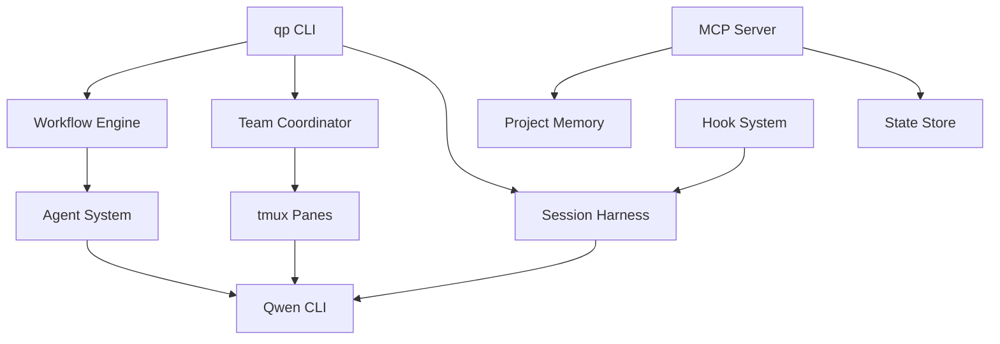

# qwen-pilot

[English](README.md) | [한국어](README.ko.md)

Multi-agent orchestration harness for Alibaba Qwen CLI. Provides prompt management, workflow execution, and team coordination for Qwen-powered development workflows.

## Features

- **Agent System** -- 15 built-in agent roles (architect, executor, reviewer, debugger, etc.) with Zod-validated definitions and model tier routing
- **Workflow Engine** -- Step-based workflow execution with gates (pass/review/test), retries, and loop support
- **Team Coordination** -- tmux-based parallel agent execution with task queuing, heartbeat monitoring, and phase management (plan/execute/verify/fix)
- **Harness Sessions** -- Enhanced Qwen CLI sessions with model tier selection (high/balanced/fast), sandbox modes, and context injection
- **State Store** -- File-based persistent state with namespaced key-value storage
- **Hook System** -- Event-driven lifecycle hooks for session, workflow, team, and task events
- **MCP Integration** -- Model Context Protocol server for tool-based interaction
- **Prompt Management** -- Markdown-based prompt definitions with YAML frontmatter

## Quick Install

```bash
git clone https://github.com/KIM3310/qwen-pilot.git
cd qwen-pilot
```

| Platform | How to install |
|----------|---------------|
| **macOS** | Double-click **`Install-Mac.command`** |
| **Windows** | Double-click **`Install-Windows.bat`** |
| **Linux** | Run `./Install-Linux.sh` in a terminal |

That's it -- the installer handles Node.js, Qwen CLI, dependencies, build, and global `qp` command registration automatically.

## Requirements

- Node.js >= 20.0.0
- Qwen Code CLI (`npm install -g @qwen-code/qwen-code`)
- tmux (optional, for team coordination)

## Installation

```bash
npm install -g qwen-pilot
```

Or use locally in a project:

```bash
npm install qwen-pilot
```

## Quick Start

```bash
# Initialize in your project
qp setup

# Launch an enhanced session
qp harness

# Use a high-tier model
qp harness --max

# Single-shot query
qp ask "Explain this codebase"

# Run a workflow
qp workflows run autopilot

# Launch a 3-worker team
qp team 3 --role executor --task "Implement feature X"
```

## CLI Commands

| Command | Description |
|---------|-------------|
| `qp setup` | Initialize qwen-pilot in the current project |
| `qp harness` | Launch an enhanced Qwen CLI session |
| `qp ask <prompt>` | Single-shot query to Qwen |
| `qp team <count>` | Launch multi-agent team with tmux |
| `qp prompts list` | List available agent prompts |
| `qp prompts show <name>` | Show details of a specific prompt |
| `qp workflows list` | List available workflows |
| `qp workflows show <name>` | Show details of a specific workflow |
| `qp workflows run <name>` | Run a workflow |
| `qp config show` | Show current configuration |
| `qp config validate` | Validate current configuration |
| `qp doctor` | Verify qwen-pilot installation |
| `qp status` | Show active sessions and status |
| `qp hud` | Show real-time session HUD |
| `qp hud --watch` | Live-updating HUD (refreshes every 2s) |
| `qp hud --compact` | Single-line output (tmux-friendly) |
| `qp tool-bench` | Run tool-call reliability and prompt optimization benchmarks |
| `qp tool-bench --verbose` | Show detailed failure information |

## Tool-Calling Optimization

A dedicated system prompt (`prompts/tool-calling.md`) optimized for Qwen models to improve tool-calling accuracy. Covers:

- Strict JSON format rules with common mistake prevention
- Parameter type enforcement (string, number, boolean, array, object, null, enum)
- Required vs optional parameter handling
- Parallel vs sequential multi-tool calling decisions
- Error self-correction patterns
- Pre-call verification checklist

The prompt is automatically appended to harness sessions when tools are available. View it with:

```bash
qp prompts show tool-calling
```

The `qp tool-bench` command runs 20 prompt-level benchmark cases across 4 categories (simple, type-coercion, multi-param, multi-tool) and compares accuracy with and without the optimization prompt.

## Tool-Reliability Middleware

Robust parsing, schema coercion, and bounded retry for LLM tool calls. Improves tool-call success rates by 10-12% over naive JSON.parse.

```bash
# Run the benchmark to see baseline vs middleware comparison
qp tool-bench
```

**Modules:**

- **rjson** -- Recovers JSON from trailing commas, single quotes, unquoted keys, comments, missing brackets, and markdown wrapping
- **schema-coerce** -- Coerces string-to-number, string-to-boolean, value-to-array, snake_case/camelCase key normalization, and enum matching
- **parser** -- Extracts tool calls from JSON, XML (`<tool_call>`), and markdown-fenced formats with validation
- **retry** -- Bounded retry with exponential backoff and error-context feedback for re-prompting
- **middleware** -- Integration layer (`executeWithToolReliability`) that wraps any LLM call

**Programmatic usage:**

```typescript
import { executeWithToolReliability, parseToolCalls, rjsonParse } from "qwen-pilot";

// Full middleware pipeline
const result = await executeWithToolReliability(prompt, tools, llmCall, {
  retry: { maxRetries: 3 },
  coercion: { normalizeKeys: true },
});

// Or use individual components
const parsed = parseToolCalls(rawOutput, tools);
const json = rjsonParse(malformedJson);
```

## HUD (Heads-Up Display)

Real-time session metrics dashboard for your terminal.

```bash
# One-shot status view (full dashboard with box-drawing)
qp hud

# Compact single-line output (tmux status bar friendly)
qp hud --compact

# Live-updating dashboard (refreshes every 2 seconds)
qp hud --watch
```

The HUD displays:
- Current model and tier
- Session status (idle / running / error)
- Prompts sent and estimated token usage
- Elapsed time
- Active workflow and step progress
- Team worker count

For tmux integration, add to `.tmux.conf`:
```
set -g status-right '#(qp hud --compact 2>/dev/null)'
```

## Configuration

Configuration is layered (user-level, project-level, environment variables):

```json
{
  "models": {
    "high": "qwen3.5-plus",
    "balanced": "qwen3-coder-plus",
    "fast": "qwen3-coder-next"
  },
  "harness": {
    "defaultTier": "balanced",
    "sandboxMode": "relaxed",
    "maxTokens": 8192,
    "temperature": 0.7
  },
  "team": {
    "maxWorkers": 4,
    "heartbeatIntervalMs": 5000,
    "taskTimeoutMs": 300000
  }
}
```

Configuration files are loaded from:
1. `~/.config/qwen-pilot/qwen-pilot.json` (user-level)
2. `.qwen-pilot/qwen-pilot.json` (project-level)

Environment variable overrides: `QP_MODEL_HIGH`, `QP_MODEL_BALANCED`, `QP_MODEL_FAST`, `QP_SANDBOX_MODE`, `QP_MAX_WORKERS`.

## Model Tiers

| Tier | Default Model | Use Case |
|------|---------------|----------|
| High | qwen3.5-plus | Complex reasoning, architecture, planning (256K context, 201 languages) |
| Balanced | qwen3-coder-plus | General implementation, review (coding-optimized) |
| Fast | qwen3-coder-next | Quick tasks, formatting, simple queries (fast coding model) |

## Built-in Agent Roles

architect, planner, executor, debugger, reviewer, security-auditor, test-engineer, optimizer, documenter, designer, analyst, scientist, refactorer, critic, mentor

## Tool Calling Optimization

All 15 agent prompts include a unified tool-calling protocol designed for first-call accuracy with Qwen models. Each prompt contains:

1. **Tool Calling Protocol** — Strict JSON format rules, parameter type matching, required field enforcement, and error recovery procedures
2. **Role-Specific Tool Guidance** — Contextual instructions for each agent's typical tool usage (e.g., the debugger gets regex escaping rules, the executor gets file path verification, the test-engineer gets assertion type matching)
3. **Structured Thinking Pattern** — A 5-step pre-call process: Goal, Tool, Parameters, Arguments, Execute
4. **BFCL-Aligned Improvements** — Parameter type annotations, multi-step chain guidance, parallel vs sequential decision rules, and optional parameter handling

These optimizations target a 10-12% improvement in correct tool-call generation on first attempt by reducing common failure modes: wrong parameter types, missing required fields, malformed JSON, and unnecessary retries.

## Built-in Workflows

autopilot, deep-plan, sprint, investigate, tdd, review-cycle, refactor, deploy-prep, interview, team-sync

## Architecture



## Project Structure

```
src/
  agents/     -- Agent role definitions and model routing
  cli/        -- Commander.js CLI interface
  config/     -- Zod-validated configuration with layered loading
  harness/    -- Session management and context injection
  hooks/      -- Event-driven lifecycle hooks
  mcp/        -- Model Context Protocol server
  prompts/    -- Prompt management
  state/      -- File-based persistent state store
  team/       -- tmux-based team coordination
  tool-reliability/ -- Robust parsing, coercion, retry, and benchmarks
  utils/      -- Shared utilities (fs, logger, markdown, process)
  workflows/  -- Step-based workflow engine
prompts/      -- Built-in agent prompt definitions (.md) + tool-calling optimization
workflows/    -- Built-in workflow definitions (.md)
__tests__/    -- Vitest test suite
```

## Development

```bash
npm install
npm run build
npm test
npm run dev    # watch mode
```

## License

MIT -- see [LICENSE](LICENSE) for details.

## Cloud + AI Architecture

This repository includes a neutral cloud and AI engineering blueprint that maps the current proof surface to runtime boundaries, data contracts, model-risk controls, deployment posture, and validation hooks.

- [Cloud + AI architecture blueprint](docs/cloud-ai-architecture.md)
- [Machine-readable architecture manifest](docs/architecture/blueprint.json)
- Validation command: `python3 scripts/validate_architecture_blueprint.py`
